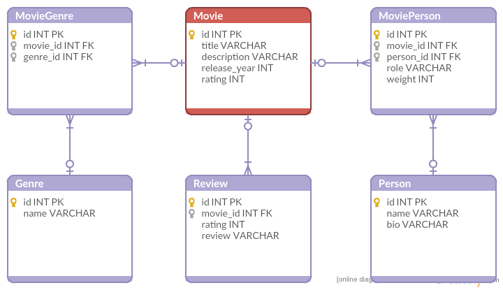

# Movie Catalogue

Customer has an IMDB-like movie database built on a relational database. 
They face scalability issues and need to rebuild the application on Cassandra.

## Existing relational schema

The Person table contains actors, directors, and other people somehow related to the Movie.
There is a many-to-many relationship between the Movie and the Person table 
(implemented by the MoviePerson table).

One movie can have many genres.

## Query requirements

1. For a given movie id, display movie title, description, release year, rating, 
list of genre names and list of persons (role, name, bio) 
sorted by role name and reverse order of role's weight.

1. For a given movie name, display movie title, description, release year, rating, 
and list of genre names. If there are duplicates, list them sorted by rating (better movies first).

1. Display top 10 movies (by rating) for a given release year. 
The columns needed are: title, description, genres, rating, release year.

1. Display all movies of a given person id in reverse order of his role's weight and movie rating.
The columns needed are: person name, movie (title, description, genres, rating, release year) 
and person's role(s).

1. OPTIONAL: Display top 10 movies (by rating) for a given genre name and release year range.
The columns needed are: title, description, genres, rating, release year.

## Homework

1. Provide the CREATE statements for the Cassandra tables.

1. Provide the SELECT statements needed for all query requirements.

1. Provide the statements required to update the rating of a movie identified by its id.

1. OPTIONAL: Create a client application that can perform the operations above.